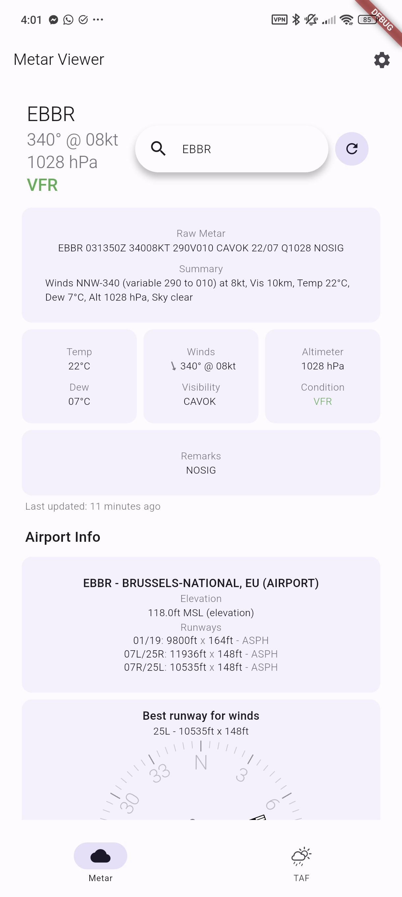
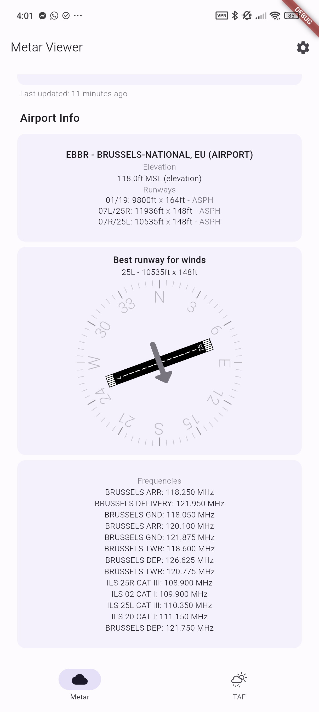
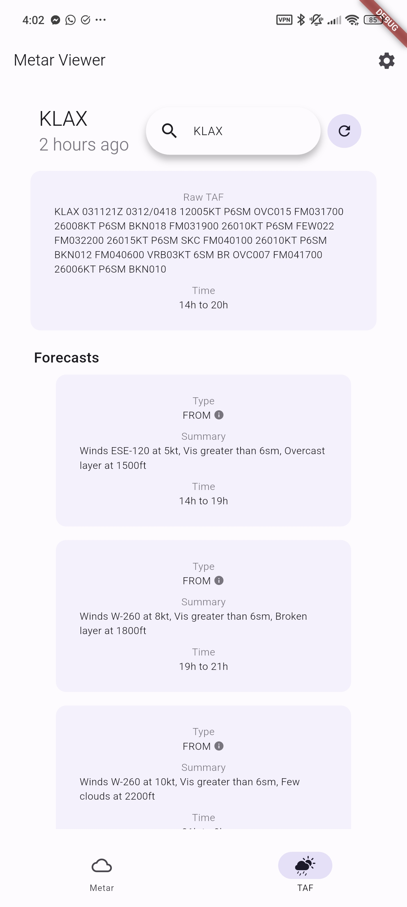
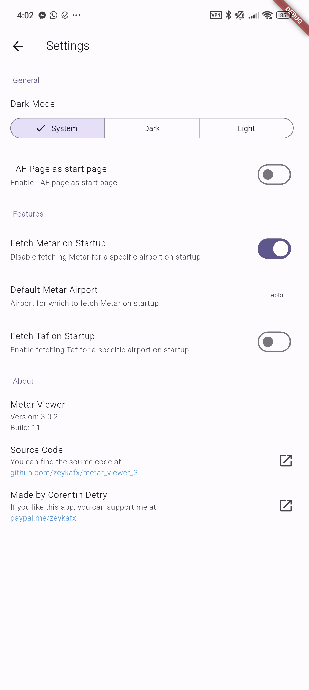

# metar_viewer_3

Metar viewer is an application that gives you a readable metar report, as well as airport information, and parsed taf reports for a given airport. It uses the [avwx](https://avwx.rest/) API to get the metar report.

Check it out on the [playstore](https://play.google.com/store/apps/details?id=com.zeykafx.metarviewer)

### Images

